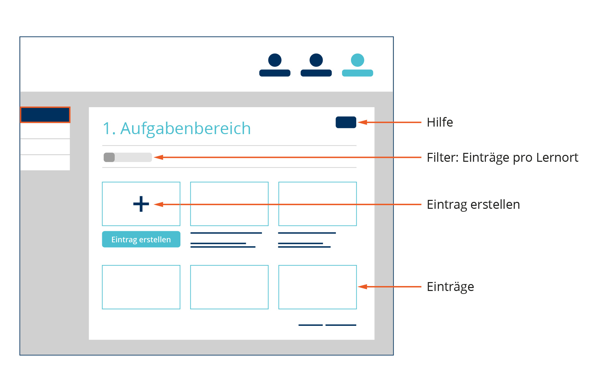

# Übersicht der Einträge eines Aufgabenbereichs
- - - 
Die untere Abbildung gibt Dir einen Überblick über die Funktionen dieser Seite.

## Was ist die Eintragsübersicht?
Bei der Eintragsübersicht kannst Du alle Deine Einträge in einem bestimmten Arbeitsbereich einsehen.
Hier siehst du das **Datum** und den **Titel** unter jedem Eintrag.

## Wie erstelle ich neue Einträge?
Klicke dazu einfach auf "Eintrag erstellen" oder das große "**+**".

## Kann ich Einträge nach meinen Lernorten filtern?
Du kannst mit der Schlatfläche "Lernort" im oberen Bereich der Seite Einträge eines bestimmten Lernortes filtern, falls Du nur Einträge eines bestimmten Lernortes sehen möchtest.

