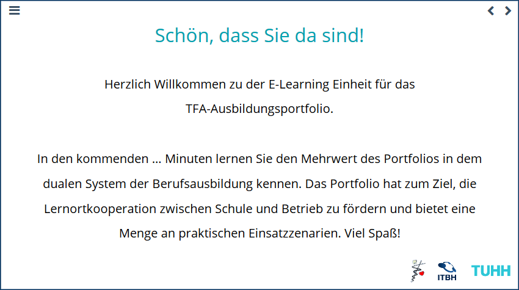

# Erste Schritte in Deinem Portfolio
- - - 

Herzlich willkommen in Deinem Portfolio! 

## Lerne das Portfolio und seine Funktionen kennen

Damit Du schnell einen Überblick über Dein Portfolio gewinnst, haben für für Dich eine interaktive Einführung in das Portfolio erstellt.

In dieser erfährst Du, 
* wie Dich das Portfolio in Deiner Ausbildung unterstützt und
* welche Funktionen und Möglichkeiten das Portfolio bietet und
* wie Du diese Funktionen nutzen kannst.

Die interaktive Einführung findest Du hier: https://360.articulate.com/review/content/f6ac7f80-eb0b-4c77-a069-9efd2366e4e6/review

